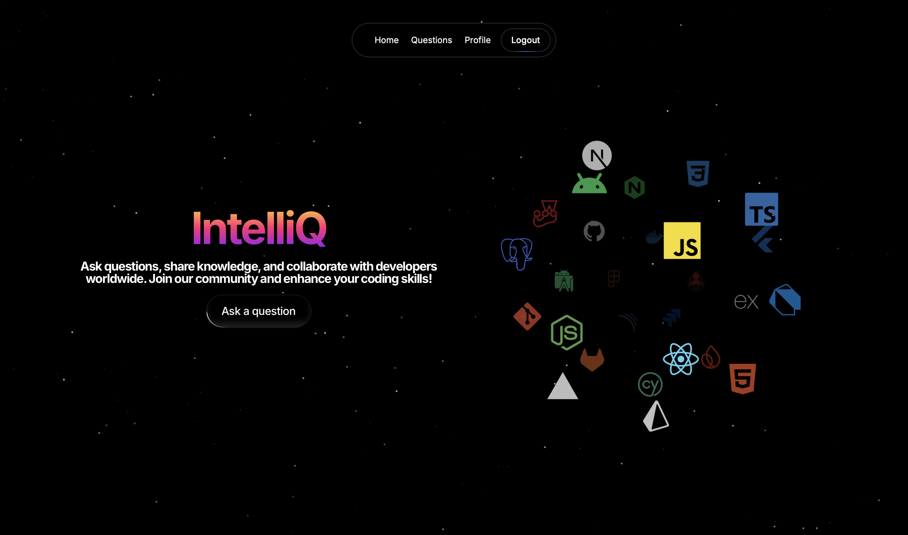
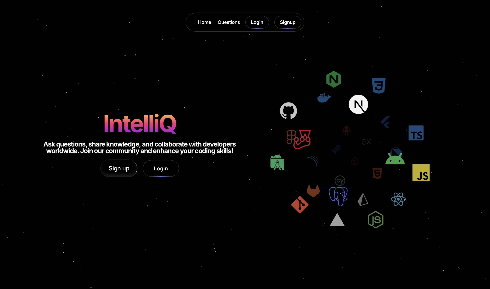
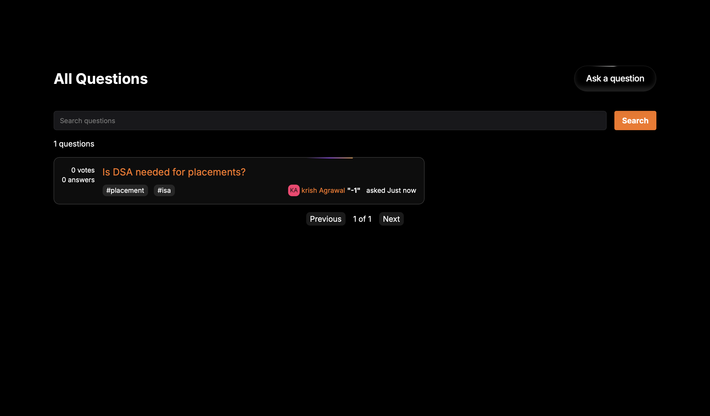
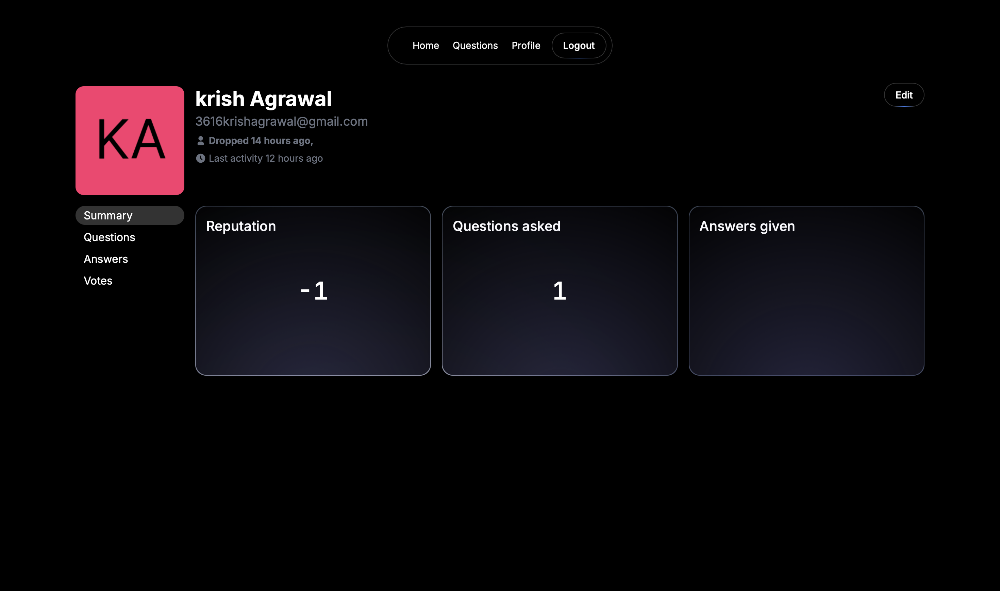

# IntelliQ 💡🧠

> A modern Stack Overflow–inspired Q&A platform built with **Next.js**, **TypeScript**, and **Appwrite**.

IntelliQ is a full-stack Question & Answer platform that enables developers to ask questions, share knowledge, vote on content, and collaborate in a modern, responsive environment. Built using **Next.js App Router**, **Appwrite**, and modern UI libraries, IntelliQ focuses on performance, scalability, and an intuitive user experience.

> **Note**
>
> This project was developed as part of my learning journey in full-stack web development using Next.js, TypeScript, and Appwrite. 
---

## 📸 Preview

| Home | Login |
|------|-------|
|  |  |

| Question | Profile |
|----------|---------|
|  |  |

---

# 🚀 Features

## 👤 Authentication & User Profiles

- Secure user authentication
- Register & Login
- Public user profiles
- Editable profile (owner only)
- SEO-friendly slug-based profile URLs
- User reputation system
- Questions asked
- Answers posted
- Vote history

---

## ❓ Questions & Answers

- Ask questions with:
  - Title
  - Rich Text Editor
  - Tags
  - Image attachments
- Edit/Delete your own questions
- Answer community questions
- Upvote & Downvote Questions
- Upvote & Downvote Answers
- Search functionality
- Pagination
- Real-time updates using Appwrite

---

## 🎨 Modern UI/UX

- Floating navigation bar
- Animated hero section
- Gradient backgrounds
- Particle animations
- Icon cloud
- Responsive design
- Smooth transitions
- Dark developer-focused theme

---

## ⚡ Performance & Architecture

- Next.js App Router
- React Server Components
- Client Components only where required
- Optimized rendering
- Hydration-safe animations
- Clean architecture
- Scalable folder structure

---

# 🛠 Tech Stack

## Frontend

- Next.js 16
- React 18
- TypeScript
- Tailwind CSS
- Framer Motion
- Magic UI
- Lucide React

## Backend

- Appwrite Authentication
- Appwrite Database
- Appwrite Storage
- Appwrite Permissions
- Appwrite User Management

## State Management

- Zustand

## Utilities

- Slugify
- Relative Time Formatter
- Custom Hooks
- Reusable Helpers

---

# 📂 Project Structure

```text
INTELLIQ
├── public
│
├── src
│   ├── app
│   │   ├── (auth)
│   │   ├── api
│   │   ├── questions
│   │   ├── users
│   │   ├── layout.tsx
│   │   └── page.tsx
│   │
│   ├── components
│   ├── components/ui
│   ├── models
│   │   ├── client
│   │   └── server
│   ├── store
│   ├── utils
│   └── types
│
├── .env.local
├── package.json
├── tailwind.config.ts
├── next.config.ts
├── tsconfig.json
└── README.md
```

---

# 🔐 Environment Variables

Create a **.env.local** file in the project root.

```env
NEXT_PUBLIC_APPWRITE_ENDPOINT=
NEXT_PUBLIC_APPWRITE_PROJECT_ID=
APPWRITE_API_KEY=
```

---

# ⚙️ Installation

Clone the repository

```bash
git clone https://github.com/yourusername/intelliq.git
```

Move into the project

```bash
cd intelliq
```

Install dependencies

```bash
npm install
```

Run the development server

```bash
npm run dev
```

Open your browser and visit

```
http://localhost:3000
```

---

# 🧠 Key Design Decisions

- Next.js App Router for scalable routing
- Server Components for optimized data fetching
- Client Components only where interactivity is needed
- Appwrite as a Backend-as-a-Service
- Reusable UI components
- Type-safe development with TypeScript
- Scalable project architecture

---

# 🌟 Future Improvements

- 🔔 Notifications
- 🔖 Bookmark Questions
- 💬 Comment System
- 🤖 AI-powered answer suggestions
- 🌐 Google & GitHub OAuth
- 📧 Email Verification
- 📈 Trending Tags
- 🏆 Leaderboard
- 📱 Progressive Web App (PWA)
- ⚡ Infinite Scrolling
- 📊 Admin Dashboard

---

# 📚 Inspiration

- Stack Overflow
- GitHub Discussions
- Dev.to
- Modern SaaS Applications
- Developer-first UX

---

# 🤝 Contributing

Contributions are welcome!

1. Fork the repository

2. Create your feature branch

```bash
git checkout -b feature/AmazingFeature
```

3. Commit your changes

```bash
git commit -m "Add AmazingFeature"
```

4. Push to the branch

```bash
git push origin feature/AmazingFeature
```

5. Open a Pull Request

---

# 📄 License

Distributed under the MIT License.

---

# 👨‍💻 Author

**Krish Agrawal**

- GitHub: https://github.com/krishagrawal623/stackoverflow-appwrite
- LinkedIn: https://www.linkedin.com/in/krishagrawal75

---

## ⭐ If you like this project, don't forget to give it a star!
